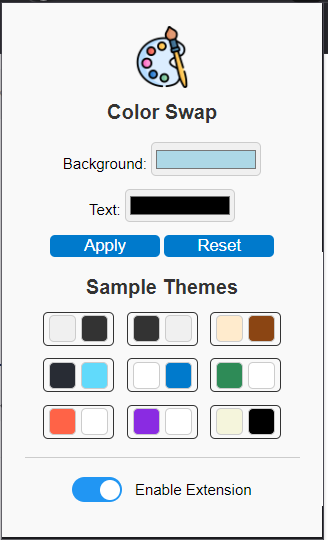

# ColorSwap Extension

**ColorSwap** is a simple and intuitive browser extension that allows you to customize the appearance of web pages by changing their background and text colors. Choose from a variety of pre-set themes or create your own color combinations to enhance your browsing experience.

## Features

- **Custom Colors**: Select your preferred background and text colors using the color picker.
- **Pre-set Themes**: Quickly apply one of the nine available themes with a single click.
- **Toggle Functionality**: Easily enable or disable the extension's effects with a toggle switch.
- **User-Friendly Interface**: Simple and clean design for easy navigation and use.

## Installation

1. Clone or download this repository to your local machine.
2. Open your browser and navigate to the extensions page:
   - For Chrome: `chrome://extensions/`
   - For Firefox: `about:addons`
3. Enable "Developer mode" (if required) and click on "Load unpacked" (Chrome) or "Load Temporary Add-on" (Firefox).
4. Select the folder containing the extension files.

## Usage

1. Click on the ColorSwap icon in your browser's toolbar to open the popup.
2. Use the color pickers to select custom background and text colors, then click "Apply".
3. Choose from the pre-set themes by clicking on the color pairs.
4. Use the toggle switch to enable or disable the extension's effects.

## Screenshots

## Contributing

Contributions are welcome! If you have suggestions for improvements or new features, feel free to open an issue or submit a pull request.

## License

This project is licensed under the MIT License. See the [LICENSE](LICENSE) file for details.

## Contact

For questions or feedback, please contact Sabeen at [hello@sabeencs.com](mailto:hello@sabeencs.com).

---
